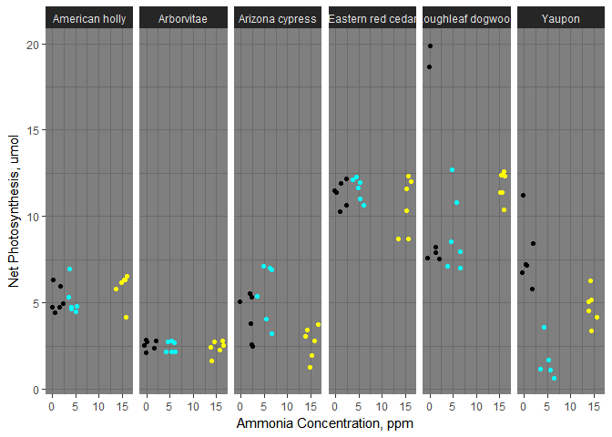

Task\_06\_final
================
Marife Anunciado
May 3, 2017

**"Atmospheric Ammonia Removal of Trees"**
==========================================

Background
----------

Six different plant species were exposed to three levels of *N**H*<sub>3</sub> (1, 5, 10 parts per million) in a laboratory-controlled setup. Physiological response on net photosynthetic rate was measured before and immediately after the exposure period.

Methods
-------

The six species were:

-   American holly
-   Arborvitae
-   Arizona cypress
-   Eastern red cedar
-   Roughleaf dogwood
-   Yaupon

An infra-red gas analyzer was used. Pre-photosynthesis signifies net assimilation of *C**O*<sub>2</sub> **before exposure** to ammonia and post-photosynthesis tells the *C**O*<sub>2</sub> **after the exposure**. The measurement were as follows:

``` r
ammonia <-read.csv("test_data.csv")
summary(ammonia)
```

    ##               Species       Levels   Pre.Photosynthesis
    ##  American holly   :18   Min.   : 1   Min.   : 0.640    
    ##  Arborvitae       :18   1st Qu.: 1   1st Qu.: 2.857    
    ##  Arizona cypress  :18   Median : 5   Median : 5.660    
    ##  Eastern red cedar:18   Mean   : 7   Mean   : 6.463    
    ##  Roughleaf dogwood:18   3rd Qu.:15   3rd Qu.: 9.107    
    ##  Yaupon           :18   Max.   :15   Max.   :19.890    
    ##  Post.Photosynthesis
    ##  Min.   : 0.880     
    ##  1st Qu.: 2.710     
    ##  Median : 5.500     
    ##  Mean   : 5.929     
    ##  3rd Qu.: 8.873     
    ##  Max.   :16.270

``` r
library(ggplot2)
data_ammonia <- ggplot(ammonia, aes(ammonia$Levels,ammonia$Pre.Photosynthesis)) + geom_jitter(stat = "identity", color= ammonia$Levels) + facet_grid(~ ammonia$Species) + xlab("Ammonia Concentration, ppm") + ylab("Net Photosynthesis, umol") + theme_dark()
print(data_ammonia)
```



Discussion
----------

**Low Treatment**

Change on the photosynthetic response of plant species was observable when exposed to ammonia concentration at all levels of treatment. The response of plants towards ammonia either affects the increase or decrease on their photosynthetic value. All four species including Yaupon, American holly, Eastern red cedar have an observable decrease on their photosynthetic rate after exposure except for Roughleaf dogwood with a slightly lower decrease on its photosynthetic value. Both for Arborvitae and Arizona cypress, photosynthetic rate was observed to increase, though the increase was observably higher on Arborvitae.

**Medium Treatment**

Yaupon and American holly still responded the same as it was in the low treatment level with a decrease on their photosynthetic rate. Both Arizona cypress and Arborvitae with higher photosynthetic value after exposure in low treatment level showed a decrease on their uptake rate when exposed to a higher concentration. On the other hand, Eastern red cedar and Roughleaf dogwood showed increased on their photosynthetic rate after medium treatment level exposure.

**High Treatment**

Most plant species were observed to have lower photosynthetic values except for Yaupon and Arizona cypress. Yaupon's photosynthetic value before exposure at low and medium treatment level remained lower than after exposure. Arizona cypress has its photosynthetic rate lower after exposure at medium level, but shown to increase again at higher concentration of ammonia. All other three species have lower photosynthetic values measured.

Conclusion
----------

Effect of ammonia concentrations on leaf gas exchange of the six plant species was affected by treatment levels. Net photosynthetic rate was significantly different among the species (P&lt;0.0001).
