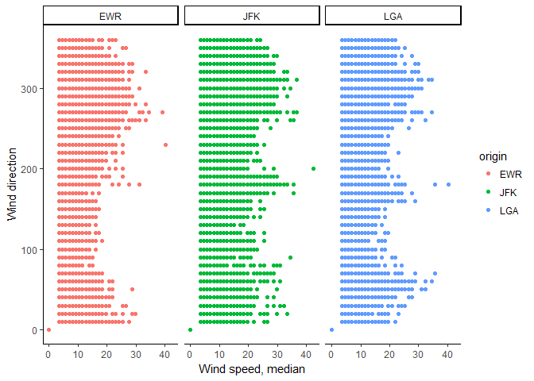
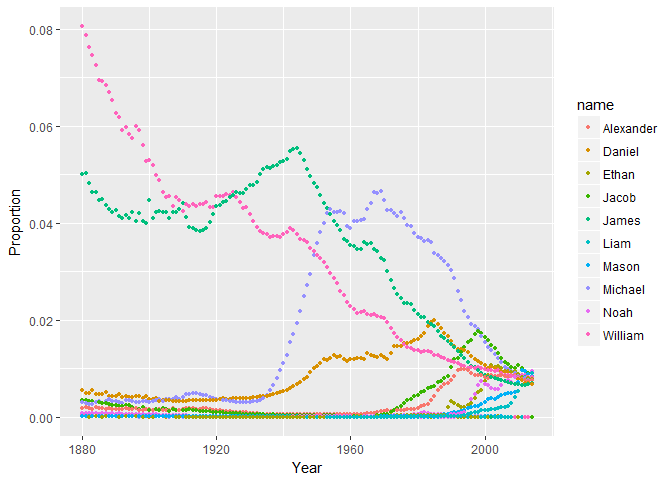
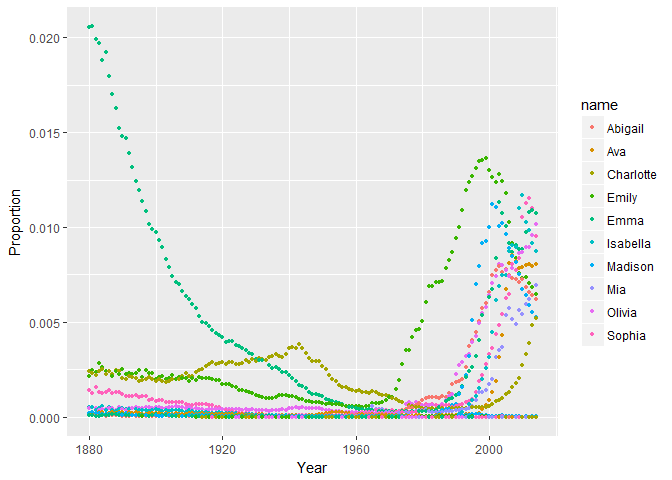

Task 7
================
Marife Anunciado
March 3, 2017

Using the nycflights13::weather
-------------------------------

Outliers in wind speed was rejected through a function **filter**, in this case wind\_speed of over a value of 250 was discarded.

    ## Source: local data frame [2,019 x 3]
    ## Groups: origin, wind_dir [114]
    ## 
    ##    origin wind_dir   med_WS
    ##     <chr>    <dbl>    <dbl>
    ## 1     EWR        0  0.00000
    ## 2     EWR       10  3.45234
    ## 3     EWR       10  4.60312
    ## 4     EWR       10  5.75390
    ## 5     EWR       10  6.90468
    ## 6     EWR       10  8.05546
    ## 7     EWR       10  9.20624
    ## 8     EWR       10 10.35702
    ## 9     EWR       10 11.50780
    ## 10    EWR       10 12.65858
    ## # ... with 2,009 more rows

Wind direction of **220 at EWR**; **200 at JFK** and **180 at LGA** airports has the highest median. Each airport's wind speed over wind direction was specifically shown as follows:

Using nycflights13::flights and nycflights13::airlines: airlines and its median distance (longest to shortest distance) travelled originating from JFK airport was displayed.
-----------------------------------------------------------------------------------------------------------------------------------------------------------------------------

The plot below shows the wide-format data frame of number of flights originating from EWR airport at each month from each airlines.
-----------------------------------------------------------------------------------------------------------------------------------

    ## Aggregation requires fun.aggregate: length used as default

| name                     |     1|     2|     3|     4|     5|     6|     7|     8|     9|    10|    11|    12|
|:-------------------------|-----:|-----:|-----:|-----:|-----:|-----:|-----:|-----:|-----:|-----:|-----:|-----:|
| Alaska Airlines Inc.     |    62|    56|    62|    60|    62|    60|    62|    62|    60|    62|    52|    54|
| American Airlines Inc.   |   298|   268|   295|   288|   297|   291|   303|   302|   282|   292|   277|   294|
| Delta Air Lines Inc.     |   279|   249|   319|   364|   377|   347|   340|   355|   423|   440|   418|   431|
| Endeavor Air Inc.        |    82|    75|    91|    88|   103|    88|    94|    96|    87|   146|   153|   165|
| Envoy Air                |   212|   196|   228|   220|   226|   218|   228|   227|   214|   140|    94|    73|
| ExpressJet Airlines Inc. |  3838|  3480|  3996|  3870|  4039|  3661|  3747|  3636|  3425|  3587|  3392|  3268|
| JetBlue Airways          |   573|   532|   612|   567|   517|   506|   546|   544|   478|   501|   544|   637|
| SkyWest Airlines Inc.    |     0|     0|     0|     0|     0|     2|     0|     0|     0|     0|     4|     0|
| Southwest Airlines Co.   |   529|   490|   532|   518|   530|   501|   526|   520|   506|   526|   490|   520|
| United Air Lines Inc.    |  3657|  3433|  3913|  4025|  3874|  3931|  4046|  4050|  3573|  3875|  3776|  3934|
| US Airways Inc.          |   363|   328|   372|   361|   381|   390|   402|   385|   341|   365|   346|   371|
| Virgin America           |     0|     0|     0|   170|   186|   180|   181|   182|   161|   170|   161|   175|

The ten most common male and female names and their popularity from 1880 to 2014 were shown in the plots below:
---------------------------------------------------------------------------------------------------------------

The most popular names in 1896, 1942 and 2014 was shown below as well as their proportion.

|  year| sex | name     |     n|       prop|
|-----:|:----|:---------|-----:|----------:|
|  1896| F   | Martha   |  2022|  0.0080240|
|  1896| F   | Esther   |  1964|  0.0077938|
|  1896| F   | Frances  |  1964|  0.0077938|
|  1896| F   | Edith    |  1932|  0.0076668|
|  1942| F   | Marilyn  |  9904|  0.0071235|
|  1942| F   | Diane    |  9550|  0.0068688|
|  1942| F   | Martha   |  9513|  0.0068422|
|  1942| F   | Frances  |  9470|  0.0068113|
|  2014| F   | Brooklyn |  6767|  0.0034908|
|  2014| F   | Lily     |  6727|  0.0034701|
|  2014| F   | Hannah   |  6512|  0.0033592|
|  2014| F   | Layla    |  6428|  0.0033159|

Using nasaweather datasets on storms
------------------------------------

1.  calculate the average disturbance for each year
2.  plot the disturbance from year 1996 to 2000
3.  look at the weather disturbance that occurred in 1995
4.  determine the months with weather disturbances

